<div align="center">



<br/>

<a href="https://github.com/shreya-osr5513">
  
</a>
&nbsp;
<a href="https://www.linkedin.com/in/shreya-gupta-7b6b96250">
  
</a>
&nbsp;
<a href="mailto:shreya.gupta.osr@gmail.com">
  
</a>

</div>

---

## `01 // PROFILE SNAPSHOT`

<div align="center">

### Third-year B.Tech ECE-AI Student at IGDTUW

📍 **New Delhi, India**

<br/>


<br/><br/>

**Currently strengthening**

`Data Structures & Algorithms` • `Backend Development` • `API Design` • `System Design`

<br/>


</div>

---

## `02 // EXPERIENCE LOG`

<table>
<tr>
<td width="24%" align="center">

### IIT Jammu
**Summer AI Intern**

`Jun 2025 — Aug 2025`

</td>
<td width="76%">

- Built backend workflows integrating **LLMs, REST APIs, Gmail API, and Google Sheets API**
- Developed an embedding-based job-matching system
- Automated structured tracking of **100+ job listings**
- Used asynchronous API calls to reduce blocking across repeated workflows

</td>
</tr>
</table>

---

## `03 // FEATURED BUILDS`

<a href="#">
  
</a>

### ResumeIQ — AI-Powered Hiring Intelligence Platform

A full-stack hiring platform with resume screening, candidate search, semantic matching, AI interview generation, recruiter dashboards, and privacy-aware preprocessing.

`React 19` `Node.js` `Express.js` `MongoDB Atlas` `Python` `FAISS` `Sentence Transformers` `Groq LLaMA-3`

<br/>

<a href="#">
  
</a>

### HireEngine — Scalable Job Aggregation & Alert Backend

A backend system that scrapes, stores, filters, and delivers relevant job opportunities through scheduler automation and event-driven alerts.

`FastAPI` `Python` `SQLite` `SQLAlchemy` `APScheduler` `BeautifulSoup` `GraphQL` `SMTP`

<br/>

<a href="#">
  
</a>

### InsightFlow — AI-Driven Business Intelligence Dashboard

An analytics dashboard for revenue, growth, category performance, product trends, and context-aware AI recommendations.

`Python` `Streamlit` `Pandas` `Plotly` `OpenAI API`

> Replace each `href="#"` with the exact repository or live-demo link.

---

## `04 // OPEN SOURCE`

```text
Harbor Framework
└── PR #1140 — merged to production
    ├── Dockerized data-aggregation pipeline
    ├── 9,994 Kaggle Superstore rows processed
    └── Focus: reproducible data workflows
```

---

## `05 // TECHNOLOGY MATRIX`

<div align="center">

### Languages

&nbsp;


### Backend & APIs

&nbsp;


### Databases


### AI Engineering


### Tools


</div>

---

## `06 // HOW I BUILD`

```text
01  Understand the workflow
02  Design the data and API layer
03  Automate repetitive steps
04  Add intelligence only where it improves the product
05  Measure, refine, and ship
```

---

## `07 // GITHUB SIGNALS`

<div align="center">


<br/>


<br/>


</div>

---

## `08 // CONNECT`

<div align="center">

### Still learning. Always building. Carefully engineering what comes next.

[**LinkedIn ↗**](https://www.linkedin.com/in/shreya-gupta-7b6b96250)
&nbsp;&nbsp;&nbsp;
[**GitHub ↗**](https://github.com/shreya-osr5513)
&nbsp;&nbsp;&nbsp;
[**Email ↗**](mailto:shreya.gupta.osr@gmail.com)

<br/><br/>


</div>
