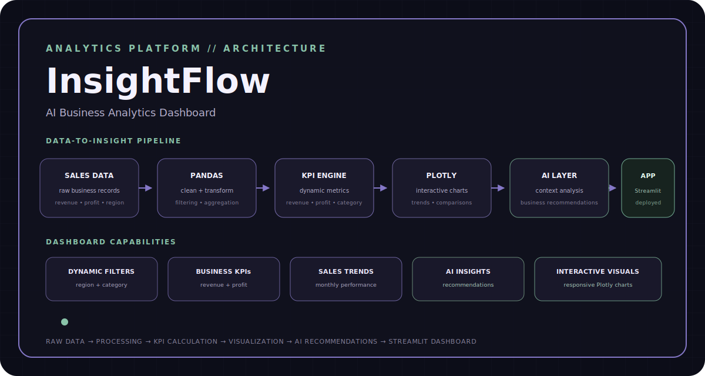

&nbsp;

&nbsp;

  

<a href="#02--experience-log">Experience</a>
&nbsp;•&nbsp;
<a href="#03--featured-builds">Projects</a>
&nbsp;•&nbsp;
<a href="#05--technology-matrix">Tech Stack</a>
&nbsp;•&nbsp;
<a href="#07--github-signals">GitHub Stats</a>

---

## `01 // PROFILE SNAPSHOT`

I enjoy building **backend-heavy applications** where APIs, databases, automation, and applied AI work together to solve practical problems.

 

  

 

Scalable backend workflows, clean REST APIs, automated systems, intelligent matching pipelines, and AI-powered product features.

  

 

`Data Structures & Algorithms` · `Backend Development` · `API Design` · `System Design`

  

 

`Understand the workflow` → `Design the system` → `Build` → `Measure` → `Improve`

 

---

## `02 // EXPERIENCE LOG`

 

> Built backend automation and intelligent job-matching workflows by combining APIs, LLMs, embeddings, and structured data pipelines.

  

 

- Built backend workflows integrating **LLMs, REST APIs, Gmail API, and Google Sheets API**
- Developed an **embedding-based job-matching system** for comparing candidate profiles with job listings
- Automated structured tracking of **100+ job listings**
- Used **asynchronous API calls** to reduce blocking across repeated data-collection and matching workflows

  

 

`Backend Automation` · `REST APIs` · `LLM Integration` · `Embeddings` · `Async Workflows`

 

---

## `03 // FEATURED BUILDS`

  

 

### AI-Powered Hiring Intelligence Platform

A full-stack hiring platform featuring resume screening, candidate search, semantic matching, AI-generated interviews, recruiter dashboards, and privacy-aware evaluation.

 

**Tech:**  
`React 19` · `Node.js` · `Express.js` · `MongoDB Atlas` · `Python` · `FAISS` · `Sentence Transformers` · `Groq LLaMA-3`

 

&nbsp;

 

  

 

### Scalable Job Aggregation & Alert Backend

A backend platform that scrapes, stores, filters, and delivers relevant job opportunities through scheduler automation and event-driven alerts.

 

**Tech:**  
`FastAPI` · `Python` · `SQLite` · `SQLAlchemy` · `APScheduler` · `BeautifulSoup` · `GraphQL` · `SMTP`

 

&nbsp;

 

  

 

### AI-Driven Business Intelligence Dashboard

An analytics dashboard for tracking revenue, growth, category performance, product trends, and context-aware AI recommendations.

 

**Tech:**  
`Python` · `Streamlit` · `Pandas` · `Plotly` · `OpenAI API`

 

&nbsp;

<!-- Replace every href="#" above with the correct repository or live-demo URL -->

---

## `04 // OPEN SOURCE`

  

 

### Dockerized Data-Aggregation Pipeline

Contributed a production-ready data workflow to the **Harbor Framework**, processing **9,994 rows** of Kaggle Superstore data.

 

`Docker` · `Data Aggregation` · `Reproducible Pipelines` · `Open Source`

---

## `05 // TECHNOLOGY MATRIX`

<strong>LANGUAGES</strong>

  

&nbsp;

  

<strong>BACKEND & APIs</strong>

  

&nbsp;

  

<strong>DATABASES</strong>

  

  

<strong>AI ENGINEERING</strong>

  

  

<strong>TOOLS</strong>

  

---

## `06 // HOW I BUILD`

&nbsp;→&nbsp;

&nbsp;→&nbsp;

&nbsp;→&nbsp;

&nbsp;→&nbsp;

 

> Understand the workflow before designing the system. Add intelligence only where it creates measurable value.

---

## `07 // GITHUB SIGNALS`

 

 

---

## `08 // CONNECT`

### Let’s stay connected.

Building, learning, and improving one system at a time.

 

&nbsp;

&nbsp;

  

